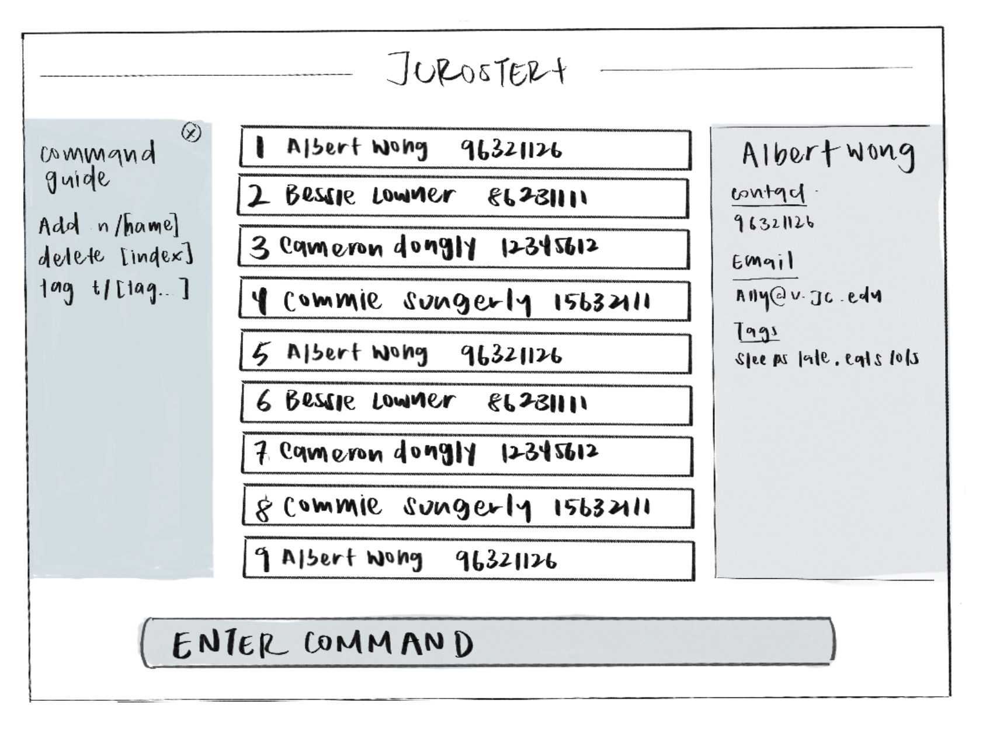

#### This project is based on the AddressBook-Level3 project created by the [SE-EDU initiative](https://se-education.org).
# JCRoster+
#### JCRoster+ streamlines contact management for Junior College homeroom teachers.

* by providing quick access to student, and guardian details.
* By integrating a smart tagging system it allows for quick categorization and seamless student grouping based on academic strengths.
* Ultimately, it reduces administrative hassle and improves efficiency in managing classroom interactions.

## Features:
### Add Students ✏️
#### Adds a student with their Grade to the address book.
`add n/NAME p/PHONE_NUMBER e/EMAIL a/ADDRESS g/SUBJECT1:GRADE,SUBJECT2:GARDE,... [t/TAG]...`

Example commands: 
>add n/John Doe p/98765432 e/johnd@example.com a/John street, block 123, #01-01 g/Math:A,Science:B,English:A,History:C,Geography:B,Music:A  
add n/Betsy Crowe e/betsycrowe@example.com a/Newgate Prison p/1234567 g/Math:A,Science:C,English:A,History:C,Geography:B,Music:A t/friend

### Delete Student 🗑️
#### Removes a student’s record from the address book.
`delete UID`  
Example commands: 
>delete 1234 
delete 98765

#### Removes multiple student's record from the address book.
`delete INDEX1 INDEX2 ...`  
Example commands: 
>delete 1 3 5 

### Find Person 🔍
#### Searches for a person in the address book based on their name.

`find KEYWORD [MORE_KEYWORDS]`

Example commands: 
>find John 
find Betsy Crowe

### Filter Person 🔽
`filter KEYWORD [MORE_KEYWORDS]`

Example commands: 
>filter BadAtMath 

### Add Remark 📝
`remark INDEX r/[REMARK INPUT]`

Example commands: 
>remark 1 r/Poor  

### Exit Program 🚪
#### Terminates the application

`exit` 
Example command:
>exit

**More features coming up...**
* For the detailed documentation of this project, see the **[JCRosters](https://ay2425s2-cs2103t-t15-2.github.io/tp/)**.
