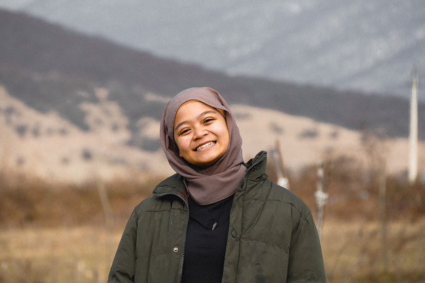

# About Us

We are team JCRoster+ based in the [School of Computing, National University of Singapore](http://www.comp.nus.edu.sg).

Please contact heytheresakinah@gmail.com for any concerns and queries.

## Project team

### Farhan Navas

[//]: # ([[homepage]&#40;http://www.comp.nus.edu.sg/~damithch&#41;])
[[github](https://github.com/farhan-navas)]
[[portfolio](https://github.com/farhan-navas)]

* Role: Project Advisor

### Nur Ain Sakinah

[[heyitssakinah](http://github.com/heyitssakinah)]

* Role: Team Lead
* Responsibilities: UI

### Haridos Sreelakshmi

[[github](http://github.com/sreelakshmiharidos)]

* Role: Documentation
* Responsibilities: Responsible for the quality of various project documents.

### Jean Doe

[[github](http://github.com/johndoe)]
[[portfolio](team/johndoe.md)]

* Role: Developer
* Responsibilities: Dev Ops + Threading
